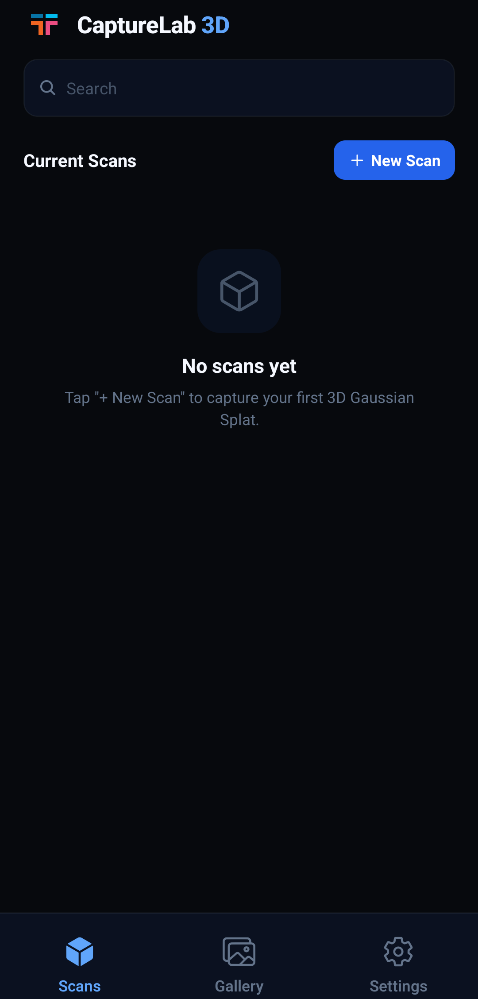
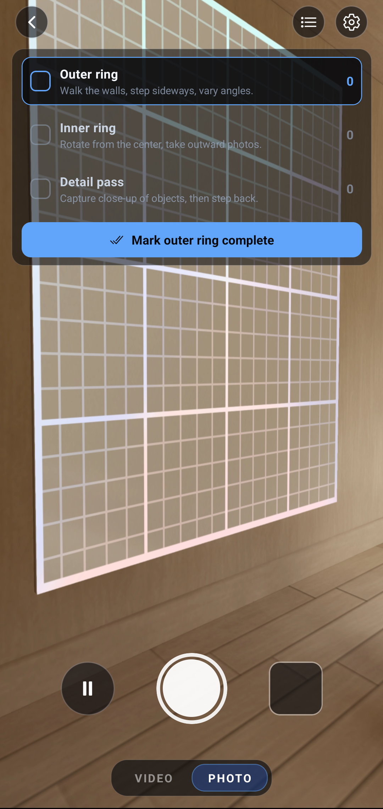

# 📸 3D Gaussian Splat Tour Camera App

<div align="center">

### Mobile Capture → Cloud Processing → Reconstruction → Interactive Viewing

An image capture and reconstruction workflow designed to simplify the process of collecting images, processing them in the cloud, and visualizing reconstructed outputs.

---


</div>

---

# 🚀 Project Overview

The **3D Gaussian Splat Tour Camera App** is a mobile-based image capture and reconstruction system that allows users to create immersive 3D scenes from captured images.

The application streamlines the process of:

- Capturing image data from a mobile device
- Uploading image sets to a cloud/backend pipeline
- Processing images into reconstructed 3D outputs
- Viewing generated scenes interactively

This project was developed as part of a Capstone project.

---

# ❗ Problem the Project Solves

Traditional reconstruction workflows often require users to:

- Capture images separately
- Transfer files manually
- Configure processing tools independently
- Wait for disconnected reconstruction pipelines
- Use external visualization software

This project simplifies that workflow by integrating the major stages into a single connected experience.

---

# 🧠 High-Level System Architecture

```text
Mobile Camera App
        ↓
Image Upload / Cloud Storage
        ↓
Colab Backend Processing
        ↓
3D Reconstruction Generation
        ↓
Interactive Viewing Interface
```

---

# 🔄 Main Workflow

## 1️⃣ Capture Images

Users capture multiple images directly from the mobile application.

## 2️⃣ Upload to Backend / Cloud

The captured image set is uploaded to backend/cloud services for processing.

## 3️⃣ Reconstruction Processing

The uploaded images are processed through reconstruction pipelines using backend processing workflows.

## 4️⃣ Interactive Viewing

Users can view and interact with the generated reconstruction outputs through the application.

---

# 🛠 Technologies & Tools

This project uses a combination of mobile development, cloud communication, and reconstruction technologies.

### Public / Student-Developed Components

- Mobile application interface
- Camera capture workflow
- Google Colab backend pipeline
- Upload and communication systems
- Reconstruction orchestration logic
- UI/UX design components

### Technologies Used

- Mobile development frameworks
- Camera APIs
- Google Colab backend processing
- Cloud storage and networking
- Reconstruction/image-processing pipelines
- REST API communication

---

# 📷 Screenshots

> Replace the placeholder screenshot paths below with actual screenshots from the application.

---

## 🏠 Home Screen



*Main landing page of the application.*

---

## 📸 Camera Capture Interface



*Users capture image sets directly from the app.*

---

## ☁️ Upload & Processing


*Images are uploaded and processed through backend services.*

---

## 🧩 Reconstruction Viewer


*Generated reconstruction results displayed inside the application.*

---

# ⚠️ Current Limitations

Some current limitations may include:

- Processing time depending on image count
- Reconstruction quality variability
- Dependence on stable network connectivity
- Hardware/device performance differences
- Limited real-time processing feedback

---

# 🔮 Future Improvements

Potential future enhancements include:

- Faster reconstruction pipelines
- Improved 3D reconstruction quality
- Better interactive visualization tools
- Real-time reconstruction updates
- Expanded device compatibility
- Improved offline capabilities
- Enhanced error handling and recovery

---

# 🔐 Public Repository Notes

This repository intentionally excludes:

- Private API keys
- Sponsor/company-owned systems
- Internal infrastructure
- Sensitive implementation details

Only student-developed and publicly shareable components are included.

---

# 👥 Intended Audience

This repository is designed for:

- Student development teams
- Researchers exploring reconstruction workflows
- Developers interested in mobile-to-cloud pipelines
- Educational demonstrations and portfolio purposes
